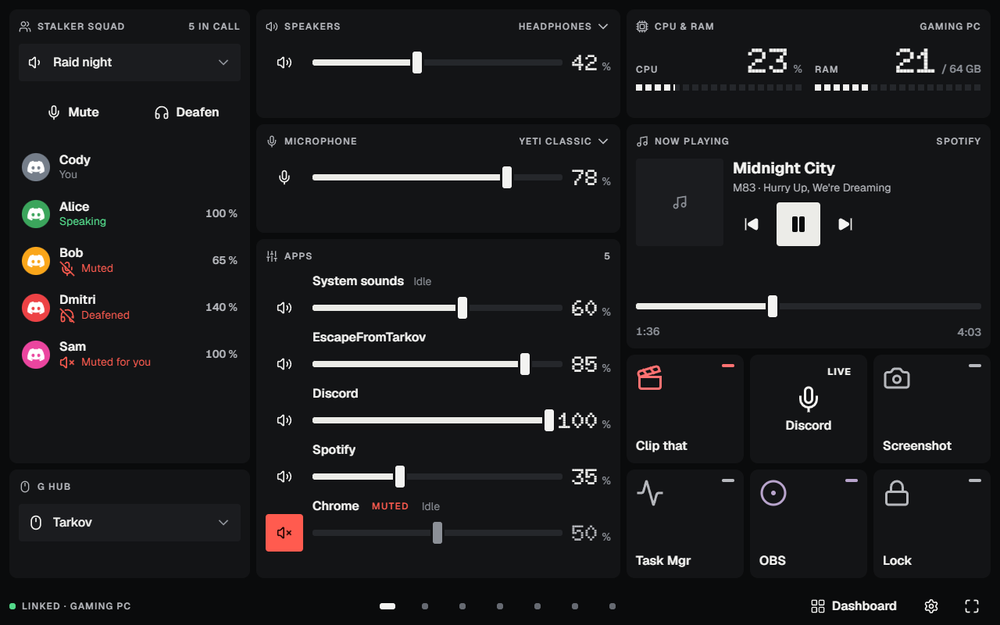
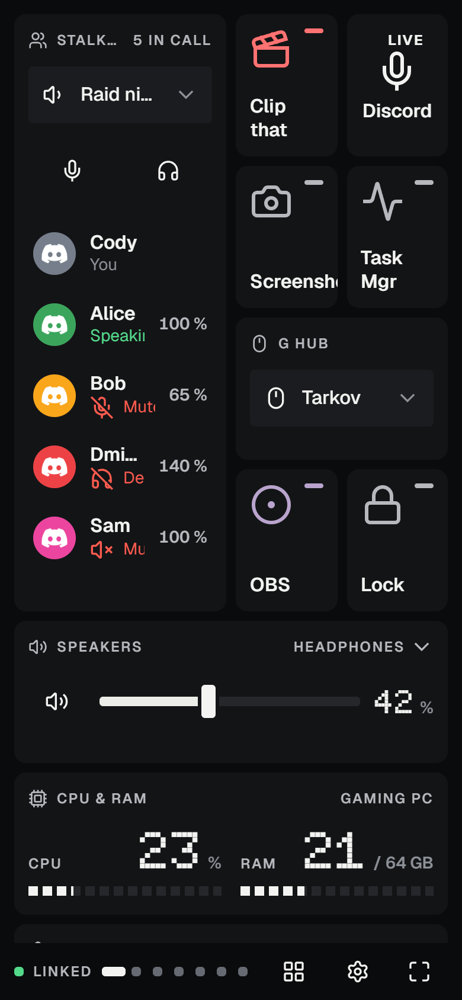
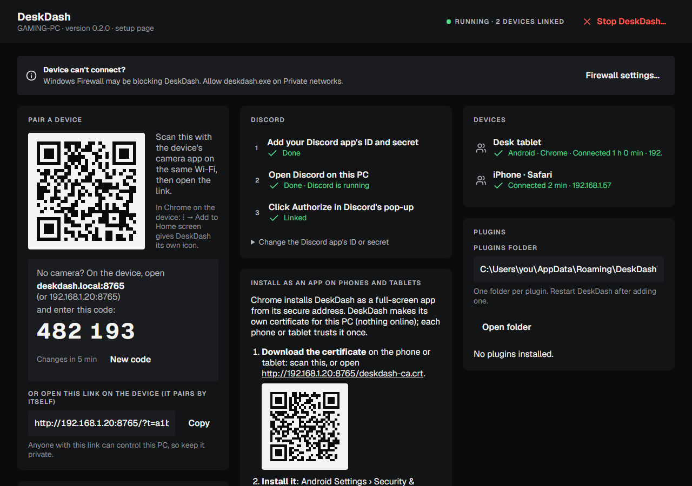
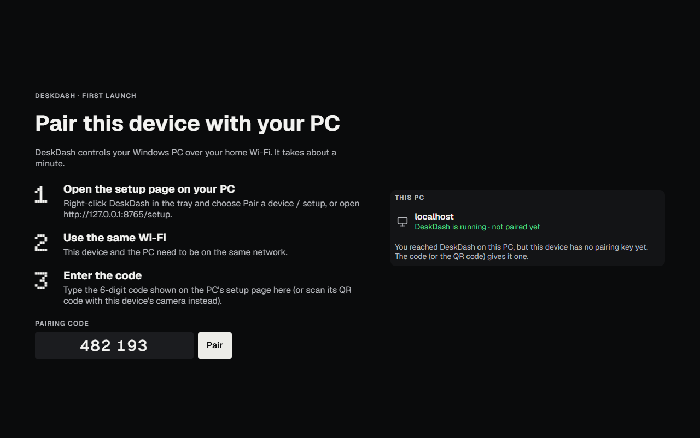
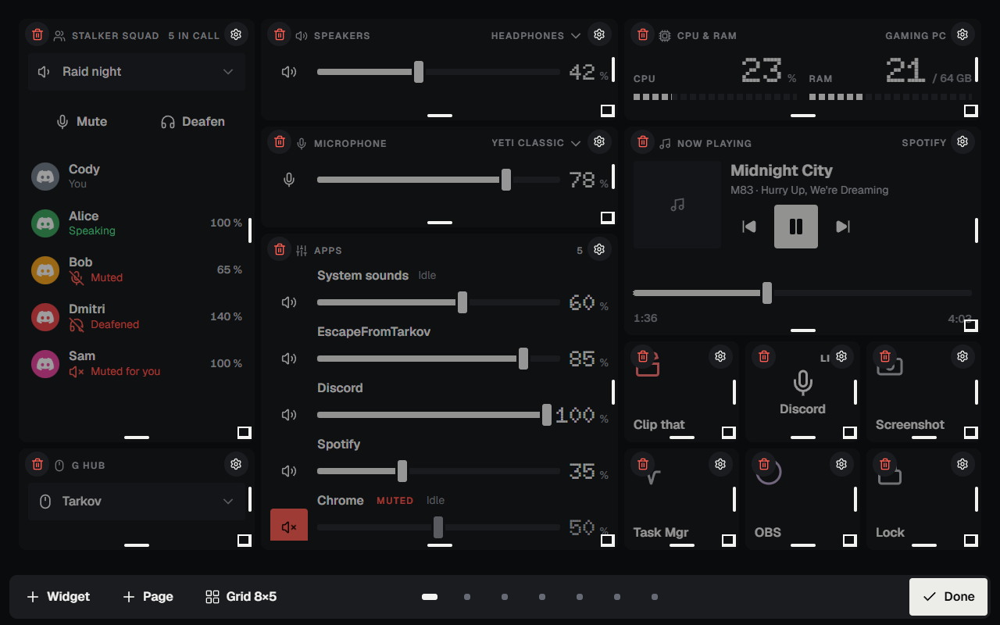
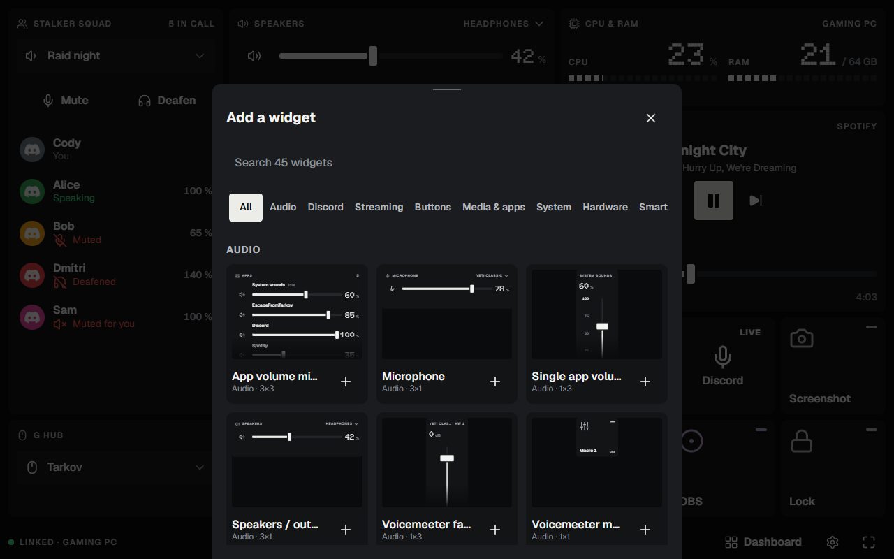
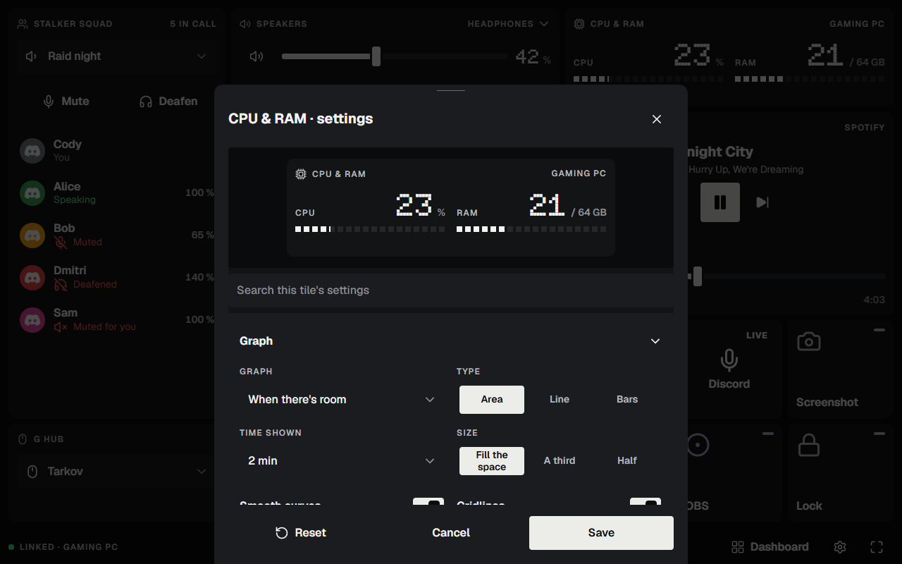
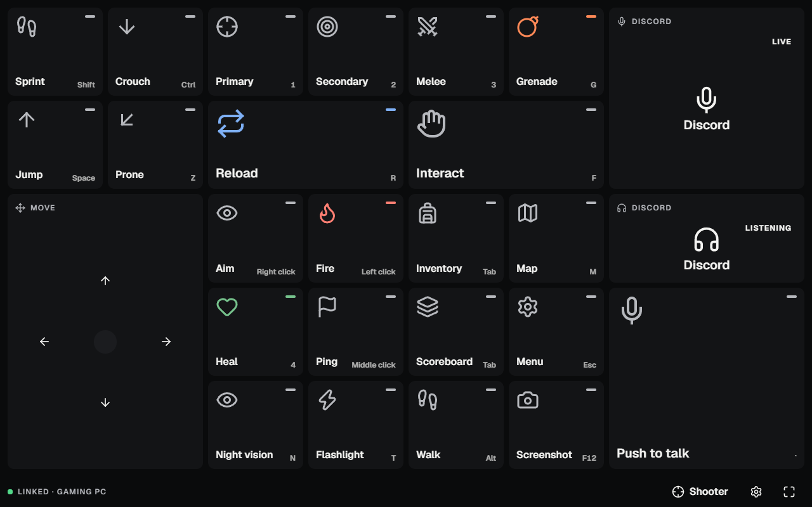
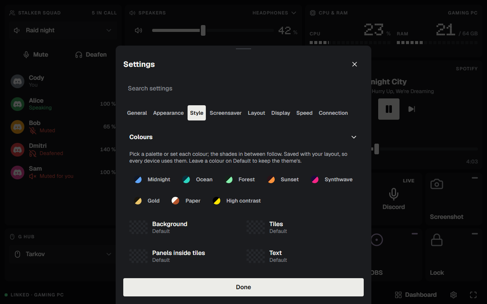
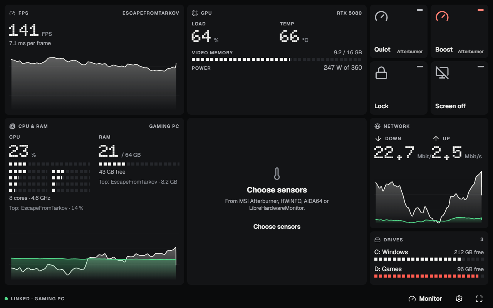

# DeskDash

**Turn a phone or tablet into a control panel for your Windows PC.** Volume and mics, Discord, OBS, game buttons,
lights and Home Assistant, hardware stats and more, on a touch screen beside your keyboard. Everything stays on your
home network: no account, no cloud.

**[Download the latest version →](https://github.com/rokshocka/DeskDash-releases/releases/latest)**

## Contents

- [What it does](#what-it-does)
- [Getting started](#getting-started): install, pair a device, make it an app, arrange it
- [How to…](#how-to): decks for games, your style, apps and integrations, updates
- [Troubleshooting](#troubleshooting)
- [Privacy](#privacy)

## What it does

- **Audio**: speakers and microphone volume, per-app volume, switching devices, and Voicemeeter strips, buses and macro buttons.
- **Discord**: who's talking, mute and deafen, per-person volume, voice settings, and (with the Vencord plugin) Go Live, camera and the soundboard.
- **Streaming**: OBS scenes, stream and record with live time, audio mixer; Streamer.bot actions.
- **Game decks**: pages of buttons for a game that come up by themselves when it's in front. Buttons tap, hold, toggle or repeat any key.
- **Your PC**: CPU, RAM, GPU, temperatures and fans (MSI Afterburner, HWiNFO, AIDA64…), game FPS, network, drives, app launcher, power buttons, monitor brightness and input.
- **Home and lights**: Home Assistant, Elgato Key Lights, WLED, Govee and Nanoleaf.
- **More**: media controls, soundboard, Microsoft Teams, OpenRGB, Wallpaper Engine, timer, weather, and plugins.

 

## Getting started

### 1. Install it on your PC

1. Download `deskdash.exe` from the [latest release](https://github.com/rokshocka/DeskDash-releases/releases/latest) and run it.
   Windows may say it's from an unknown publisher (it isn't code-signed yet): choose **More info › Run anyway**.
2. Choose **Yes** to install. DeskDash goes in your user folder (no admin needed), appears in the Start menu, and
   starts with Windows. If the firewall asks, allow it on **Private** networks.
3. Its **setup page** opens in your browser. You can open it again any time from the DeskDash icon in the tray
   (bottom right of the taskbar) or from the Start menu.

### 2. Pair your phone or tablet

Use the same Wi-Fi as the PC, then either:

- **Scan** the QR code on the setup page with the device's camera and open the link, or
- **Type**: on the device, open **deskdash.local:8765** in the browser and enter the **6-digit code** from the setup
  page. (If that address doesn't open, use the one shown next to it, like `192.168.1.20:8765`.)

The device remembers the pairing, so you only do this once. Pair as many phones, tablets and PCs as you like.

### 3. Make it feel like an app

- **Home screen icon**: in Chrome, ⋮ › **Add to Home screen** (Safari: Share › Add to Home Screen).
- **Full screen**: tap ⛶ at the bottom right. It stays full screen after a reload (on its first tap).
- **As an installed app** (full screen, no browser bar, screen kept on): the setup page's *Install as an app* card walks
  you through a one-time step for the secure address.

### 4. Arrange your dashboard

- **Press and hold** anywhere on the dashboard to edit. Drag tiles to move them and their corner to resize.
  ⚙ opens a tile's settings, 🗑 removes it (with Undo).
- **+ Widget** opens the library: every widget with a live preview, by category, with search.
- **+ Page** adds a page; swipe between pages. **Grid** changes the number of columns and rows, or turns on small tiles.
- Tap **Done** when you're happy.

Each tile has its own settings: what it shows, its size, colours, picture, and more.

## How to…

### Make a deck for a game

A **deck** is its own set of pages, like a Stream Deck profile. Tap the deck name at the bottom right › **New deck**,
and start from a template (Shooter, Flight, MMO, Stream, Monitor) or from scratch. In the deck's settings, **Opens with**
lists the game's program (e.g. `EscapeFromTarkov.exe`): the deck comes up by itself while that game is in front.

Game buttons send real key presses the game sees: tap, **hold** (down while your finger is), **toggle** or **repeat**.
The key picker builds combinations like `Ctrl+Shift+M`. A **D-pad** slides between directions.

### Change the look

**Settings › Style**: palettes (Midnight, Ocean, Synthwave, Paper…) or your own colours; a wallpaper per page or deck
(colour, gradient, picture, slideshow or video, with panning like a phone's home screen); frosted see-through tiles;
and any tile's own colours or picture. It's saved with your layout, so every device matches.
**Settings › Appearance** picks the theme (Console or Studio), dark or light, and sizes for this device.

### Give a phone its own layout

**Settings › General › This device shows**: the shared dashboard, any deck, or a layout just for this device (copied
from the dashboard or empty). Editing on a phone offers this too, so a phone can have a tidy one-column layout.

### Connect your apps

Most connect by themselves once the app is running on the PC. The setup page has a card for those that need a detail.

| App | What to do |
|---|---|
| Media (Spotify, browsers…) | Nothing: anything in Windows' media controls shows up. |
| Voicemeeter, G HUB | Just have them running. |
| Discord | The setup page's Discord card walks you through a one-time link (about two minutes). |
| Discord Go Live, camera, soundboard | Needs the DeskDash plugin for Vencord (see the setup page). |
| OBS Studio | In OBS: Tools › WebSocket Server Settings › Enable. Add the password on the setup page if it has one. |
| Home Assistant | Setup page › Home Assistant: DeskDash finds it; paste a long-lived access token (your profile › Security in Home Assistant). |
| Lights | Elgato, WLED and Nanoleaf are found by themselves; Govee needs *LAN Control* on in the Govee Home app. Pair a Nanoleaf from its tile. |
| Temperatures and fans | Run MSI Afterburner, or HWiNFO with *Shared Memory Support* on, or AIDA64 or LibreHardwareMonitor. |
| Game FPS | RivaTuner Statistics Server (comes with MSI Afterburner) running while you play. |
| Monitors | Turn on DDC/CI in the monitor's own menu (most have it on already). |
| Streamer.bot | Servers/Clients › WebSocket Server › Start (and Auto start). |
| Microsoft Teams | Teams › Settings › Privacy › Manage API › Enable API; the first press asks you to allow DeskDash. |
| OpenRGB | SDK Server tab › Start Server. |

### Update DeskDash

DeskDash checks for new versions by itself. When one is out, the tray menu shows **Update to …**, and the setup page
and each device's Settings › Connection offer **Update**, with what's new. DeskDash downloads it, checks it's a real
DeskDash release, and restarts; your devices reconnect by themselves. **Go back to …** undoes an update.
To check right away: tray icon › **Check for updates**.

### Uninstall

Windows Settings › Apps › Installed apps › DeskDash › Uninstall. It asks whether to keep your settings and layout.

## Troubleshooting

- **A device can't connect.** Is it on the same Wi-Fi as the PC (not a guest network)? Then check the firewall: setup
  page › *Firewall settings…*, and tick **Private** for DeskDash.
- **deskdash.local doesn't open.** Some Android versions don't look up `.local` names: use the numbered address the
  setup page shows. To keep that number from changing, reserve it for your PC in your router (a *DHCP reservation*).
- **Discord doesn't connect.** Follow the setup page's Discord card; it shows which step is missing. It works with the
  official Discord app.
- **The screen turns off.** Keeping the screen on works when DeskDash runs as an installed app (step 3). Otherwise raise
  the device's screen timeout.
- **Something's wrong with my layout.** Settings › Layout keeps backups of earlier layouts: restore one.

## Privacy

DeskDash runs on your PC and talks to your devices on your own network. Nothing goes to the internet except checking
for updates (on this page), weather (if you use the weather tile, from Open-Meteo), and services you connect yourself.
There's no account and nothing is collected.
